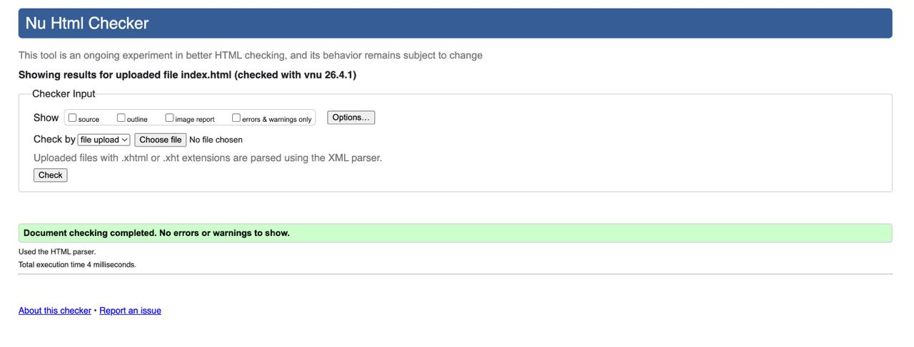
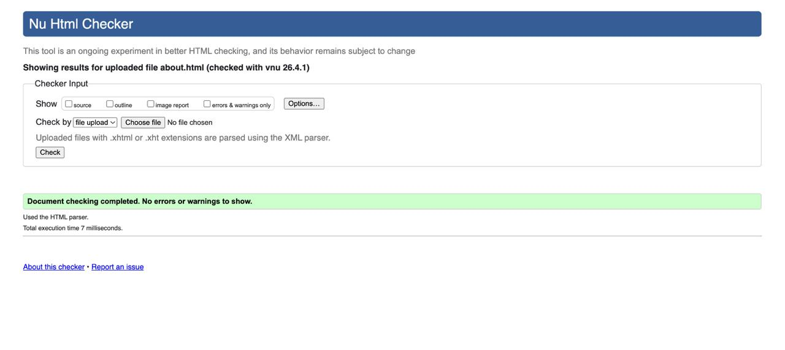
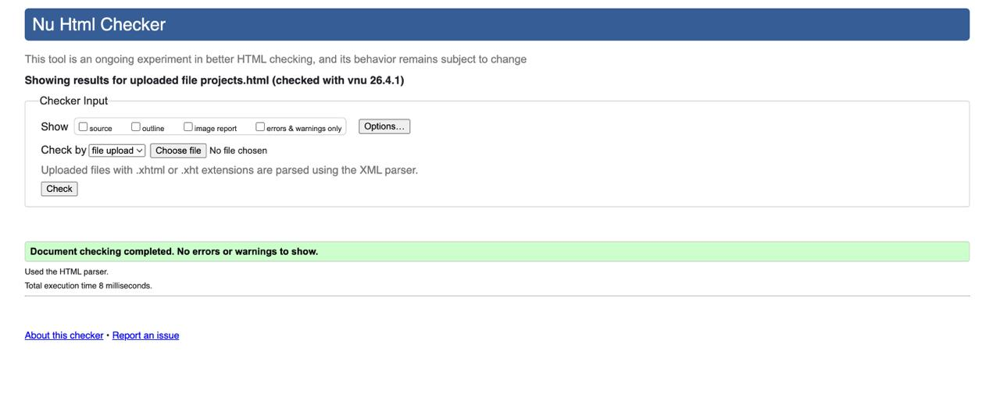
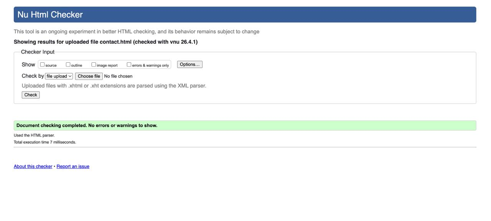
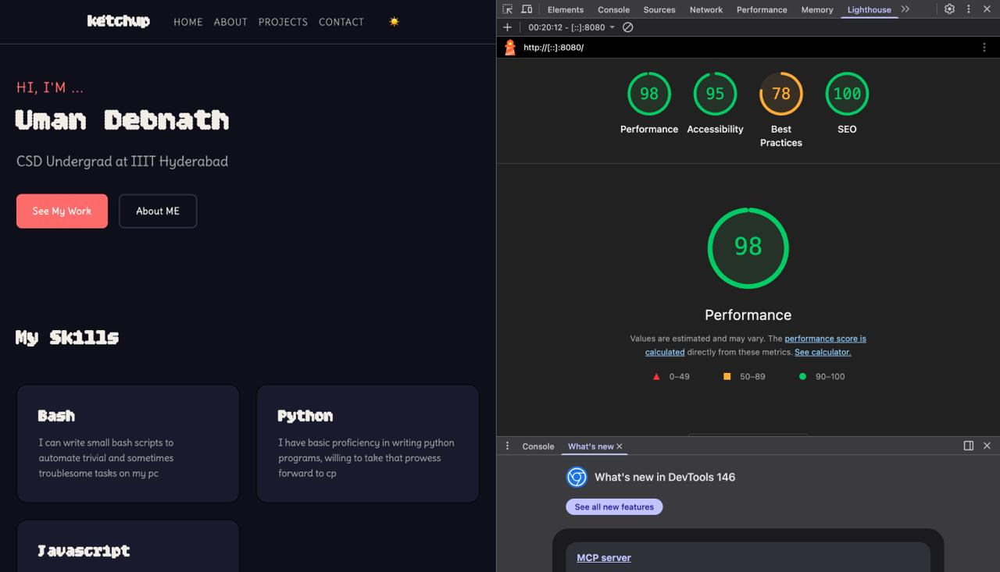
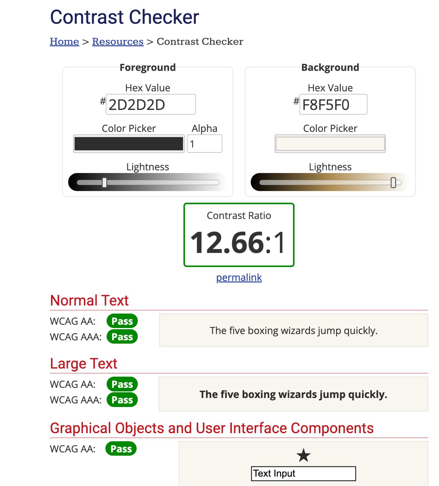
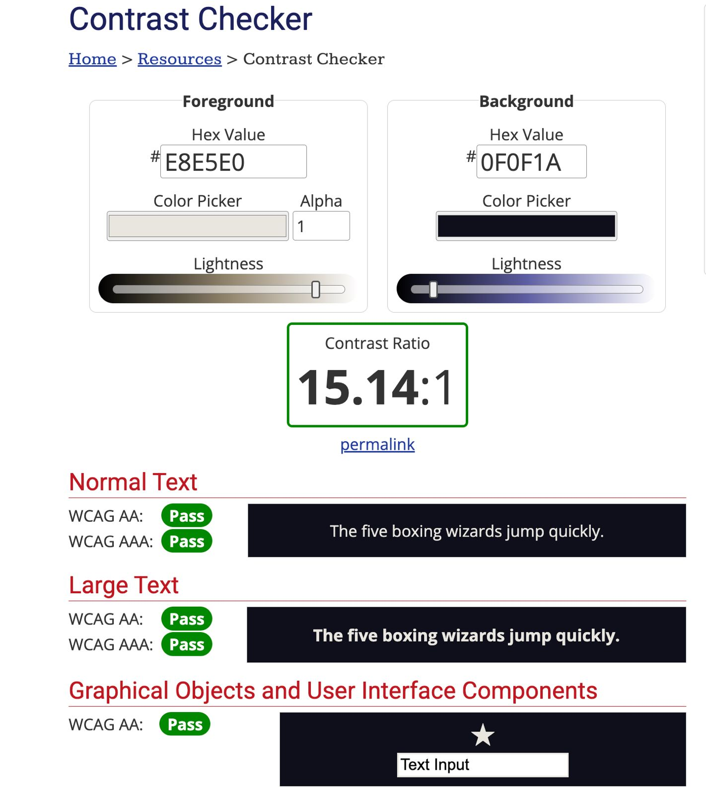

# Assignment 2 Portfolio Website

Name: Uman Debnath  
Roll Number: 2025111037  
Live URL: https://researchweb.iiit.ac.in/~uman.debnath/

## Setup

This project is a static personal portfolio website built using only HTML, CSS, and JavaScript.

There is no build step or dependency installation required. To run it locally:

1. Open the project folder.
2. Start a simple local server, for example:
   `python3 -m http.server 8000`
3. Open `http://localhost:8000/index.html` in a browser incognito window.

You can also check the final deployed website at https://researchweb.iiit.ac.in/~uman.debnath/

## Features

This website contains four pages: Home, About, Projects, and Contact. It uses semantic HTML, a shared design system in CSS custom properties, a light and dark theme with persistence, CSS-based animation, and simple JavaScript for interactivity.

My selected D4 features are:

Group A Choice: A2 — Session-Persistent Reading Progress  
Group B Choice: B2 — Collapsible Timeline with Event Delegation

For A2, I implemented a reading progress system on the About page using an ES module in its own file. The feature creates a progress bar, tracks scroll depth, stores the last meaningful reading position in `sessionStorage`, and offers the user a resume prompt when they return to the About page in the same session. I used `pagehide` and `pageshow` to make the state feel consistent across navigation, and I kept the feature separate from the rest of the page logic by initializing it through `js/about.js`.

For B2, I built the About-page timeline from a single `<ul>` and handled interaction through one delegated click listener on the container. Each timeline item expands and collapses by toggling a class that controls a `max-height` transition. The trigger buttons update `aria-expanded` correctly, and only one item remains open at a time. The implementation is intentionally simple enough.

Other implemented features include:

- Theme toggle with `localStorage` persistence across sessions.
- Client-side validated contact form with a styled success state.
- Responsive layouts using Flexbox and Grid.
- A featured project card that spans the full grid width on larger screens.

## Design Decisions

I chose **Bitcount Grid Double** as the display font and **Delius** as the body font. Bitcount Grid Double has a distinctive dotted, digital feel which I can relate to more because of the iconic nothing font (yea i have a nothing phone and im a big nothing fan), so I think it gives the site a more personal and memorable identity than a standard serif or sans-serif heading font. It works well for large headings because it immediately creates a technical and slightly experimental tone, which suits a portfolio built around programming, systems, and project work. Delius softens that visual style by making paragraphs feel more human and conversational. I liked this contrast because it keeps the headings expressive without making the actual reading experience too harsh or mechanical.

The site uses a CSS custom-property system for colours, type scale, spacing, radius, and motion. I kept both light and dark themes under the same token system so the site can switch themes without changing the structure of the stylesheet. The theme transition is animated so the switch feels intentional rather than abrupt, and the current preference is stored using `localStorage`. 

The responsive layout includes real structural changes, not just font scaling. On smaller screens, most content stacks into a single-column layout. On larger screens, the project cards move into a multi-column grid, and the featured project spans the full available width using an explicit grid span. This makes the Projects page feel more like a portfolio showcase on desktop while remaining readable on mobile.

The required D3 animations were chosen to communicate hierarchy and state:

- Hero entrance sequence: the greeting, name, tagline, and call-to-action enter in a staggered sequence so the user’s attention is guided through the introduction in a deliberate order instead of being hit with everything at once.
- Scroll reveal: sections below the fold animate into view when they enter the viewport so longer pages feel progressive and easier to scan. The animation is handled by CSS, while JavaScript only adds the reveal class using Intersection Observer.
- Purposeful micro-interaction: the navigation underline uses a custom `cubic-bezier(0.4, 0, 0.2, 1)` timing function. I chose this because it feels more polished than a default timing curve: it begins gently, accelerates in the middle, and settles cleanly, which matches the subtle guiding role of navigation feedback.

## Accessibility Notes

The site is designed to remain usable with keyboard navigation and visible focus states. Interactive controls such as the theme toggle, timeline buttons, and contact form fields all preserve a visible focus indicator.

For reduced motion, I added a `prefers-reduced-motion` media query and documented it in the CSS. In that mode, decorative animations, smooth scrolling, and motion-heavy transitions are disabled so the experience is more comfortable for motion-sensitive users.

The JavaScript features are progressively enhanced. If JavaScript is disabled, the main content is still readable: scroll-reveal sections remain visible, and timeline content remains available instead of staying collapsed.

ARIA is used where appropriate:

- The theme toggle updates `aria-pressed` and its label.
- The reading progress bar exposes progress semantics.
- The resume prompt is marked as a dialog.
- Timeline triggers update `aria-expanded`.
- Form errors use field-specific validation messaging.

I also kept the contact form validation on the client side only, as required by the assignment.

## Screenshots

- W3C HTML validation screenshot: 

- Lighthouse audit screenshot:

- WCAG contrast screenshot for light theme:

- WCAG contrast screenshot for dark theme:

